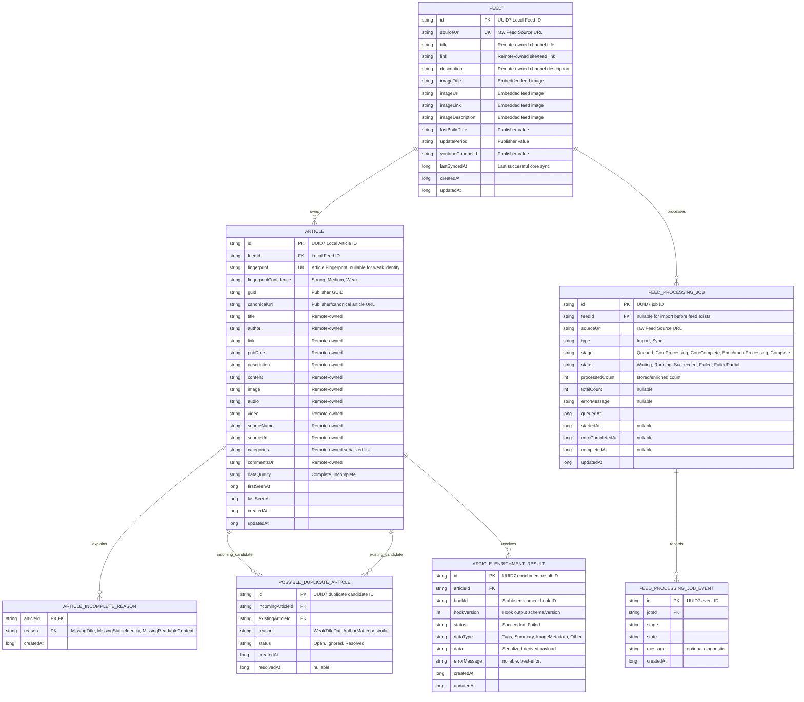
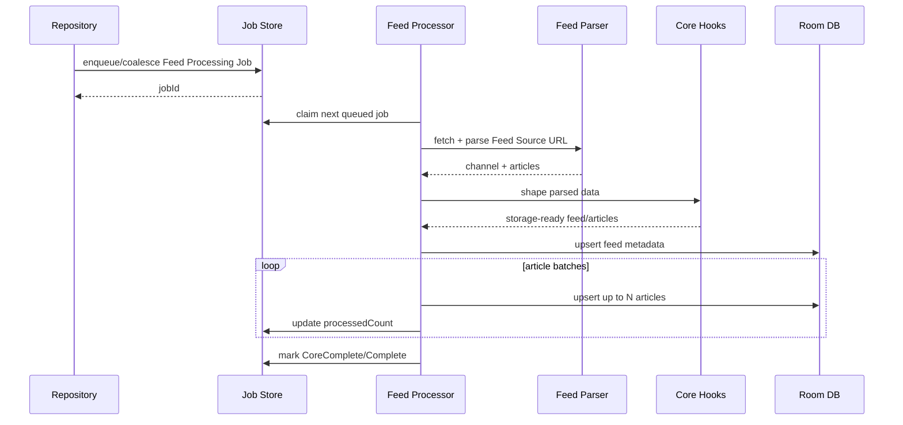
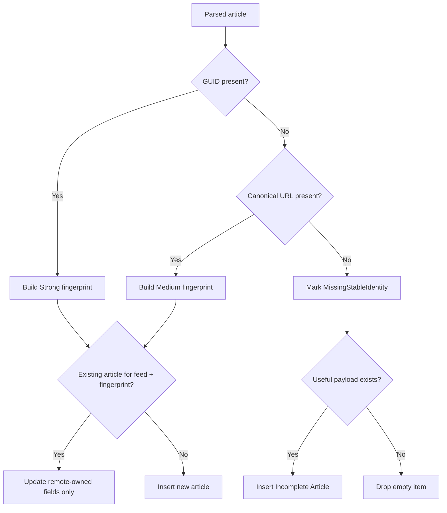
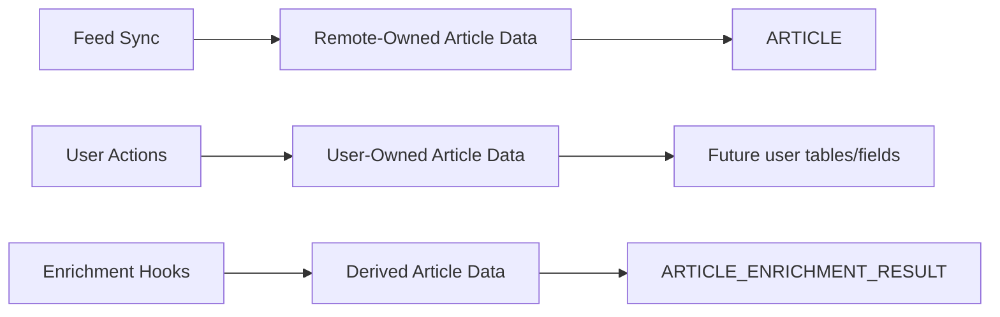

# Feed Import and Sync ERD

This ERD expands the feed import and sync PRD into a database-oriented model. It separates current feed storage from proposed queue, identity, quality, and enrichment tables needed for queue-first processing.

## Legend

- **Current**: already represented by the local Room feed/content tables, though fields may need to change.
- **Proposed**: required by the PRD but not yet implemented.
- **Future**: useful extension point, not required for the first implementation.

## High-Level Model

## First-Implementation Tables

### `FEED`

Purpose: one stored feed subscription.

Important decisions:
- `id` should become UUID7, replacing the current auto-increment integer.
- `sourceUrl` stores the raw user-provided URL and is the current feed identity.
- Exact raw `sourceUrl` match is enough for coalescing and duplicate prevention in this phase.
- Robust duplicate detection across redirects, self links, and normalized URLs is future scope.
- Feed metadata is remote-owned and can be updated by **Feed Sync**.

Suggested constraints:
- Primary key: `id`.
- Unique index: `sourceUrl`.
- Index: `title` for feed list sorting if still useful.

### `ARTICLE`

Purpose: one locally stored article/post from a feed.

Important decisions:
- `id` should be UUID7 and used by UI/routes.
- `feedId` points to the owning feed.
- `fingerprint` is separate from local ID and is used for sync matching.
- `fingerprint` can be nullable when identity is weak or incomplete.
- Strong fingerprint uses publisher GUID when present.
- Medium fingerprint uses canonical URL when GUID is absent.
- Weak matches must not overwrite an existing article.
- Remote-owned fields can be updated by **Feed Sync**.
- User-owned fields should not live in this table unless update paths explicitly preserve them.

Suggested constraints:
- Primary key: `id`.
- Foreign key: `feedId -> FEED.id`, cascade on feed delete.
- Unique index: `(feedId, fingerprint)` where `fingerprint IS NOT NULL`.
- Index: `(feedId, pubDate)` for feed-specific article ordering.
- Index: `lastSeenAt` for future diagnostics.

### `FEED_PROCESSING_JOB`

Purpose: durable queue row for imports and syncs.

Important decisions:
- Repository enqueue APIs create or coalesce these rows.
- Import jobs may start without an existing `feedId`.
- Sync jobs should have a `feedId`.
- One feed-level **Core Processing Stage** runs at a time.
- Active jobs for the same exact raw `sourceUrl` are coalesced.
- Core progress can be indeterminate; count fields become more useful after parse or during enrichment.
- Partial failures keep stored data visible.

Suggested constraints:
- Primary key: `id`.
- Foreign key: nullable `feedId -> FEED.id`.
- Index: `(stage, state, queuedAt)` for claiming next job.
- Partial unique index, if Room/schema supports it cleanly: active job by `sourceUrl` where job is queued/running.
- Otherwise enforce active-job coalescing in DAO transaction.

### `ARTICLE_INCOMPLETE_REASON`

Purpose: small structured reason set for incomplete articles.

Initial reasons:
- `MissingTitle`.
- `MissingStableIdentity`.
- `MissingReadableContent`.

Suggested constraints:
- Composite primary key: `(articleId, reason)`.
- Foreign key: `articleId -> ARTICLE.id`, cascade on article delete.

## Optional/Future Tables

### `POSSIBLE_DUPLICATE_ARTICLE`

Purpose: record weak matches without overwriting existing articles.

First implementation can skip this table if weak matches only insert new incomplete/normal articles and no UI exposes duplicate review. Add it when duplicate review or diagnostics become product-visible.

### `ARTICLE_ENRICHMENT_RESULT`

Purpose: store derived outputs from **Enrichment Hooks** without mutating publisher-owned or user-owned fields.

First implementation can skip this table if no enrichment hooks are actually shipped. Add it when hook output needs persistence.

Important constraints when added:
- Enrichment identity should include `(articleId, hookId, hookVersion)`.
- Hook failures must not fail the feed processing job.
- Retrying failed enrichments is future scope.

### `FEED_PROCESSING_JOB_EVENT`

Purpose: append-only diagnostics for job transitions.

First implementation can skip this table if current job row fields are enough for UI and debugging. Add it if users or developers need a visible timeline of job attempts.

## Core Processing Write Flow

## Sync Matching Flow

## Data Ownership Boundaries

Rules:
- **Feed Sync** may update remote-owned fields.
- **Feed Sync** must not remove articles missing from the latest feed response.
- **Feed Sync** must not overwrite user-owned fields.
- **Enrichment Hooks** write derived data, not publisher-owned data.
- User-owned data should be modeled separately when bookmarks, read state, saved state, or user tags are added.

## Current Schema Delta

Current DB already has:
- `LocalRssFeed`.
- `LocalRssContentFeedPost`.
- Feed-to-post foreign key.
- Embedded feed image, YouTube channel, enclosure, media, and YouTube item data fields.

PRD-driven schema changes:
- Change feed ID from integer to UUID7 string.
- Ensure article ID is UUID7 string.
- Add raw `sourceUrl` to feed.
- Add article `fingerprint` and fingerprint confidence.
- Add article data quality and incomplete reasons.
- Add feed processing job table.
- Add job DAO operations for enqueue, coalesce, claim, progress update, success, failure, and partial failure.
- Add indexes needed for sync matching and queue claiming.

## Implementation Notes For Agents

- Keep exact raw `Feed Source URL` as the feed identity for now.
- Do not add raw XML/raw payload storage.
- Do not add multi-identity article architecture.
- Do not add automatic scheduling.
- Do not add enrichment retry.
- Prefer DAO transaction methods that make enqueue/coalesce and claim-next-job atomic.
- Keep `POSSIBLE_DUPLICATE_ARTICLE`, `ARTICLE_ENRICHMENT_RESULT`, and `FEED_PROCESSING_JOB_EVENT` optional unless implementation scope needs them immediately.
