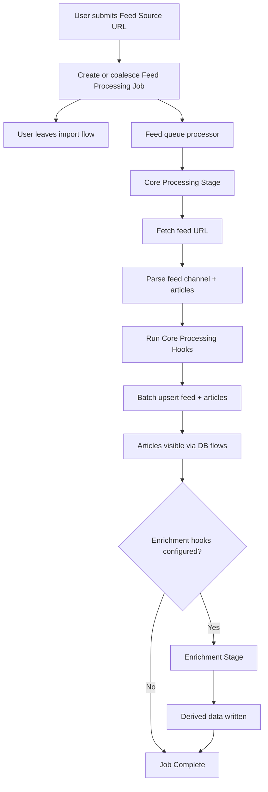
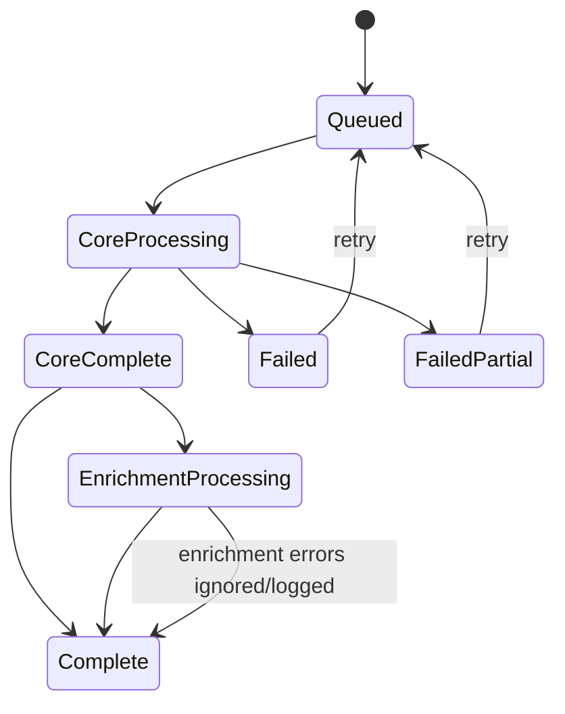
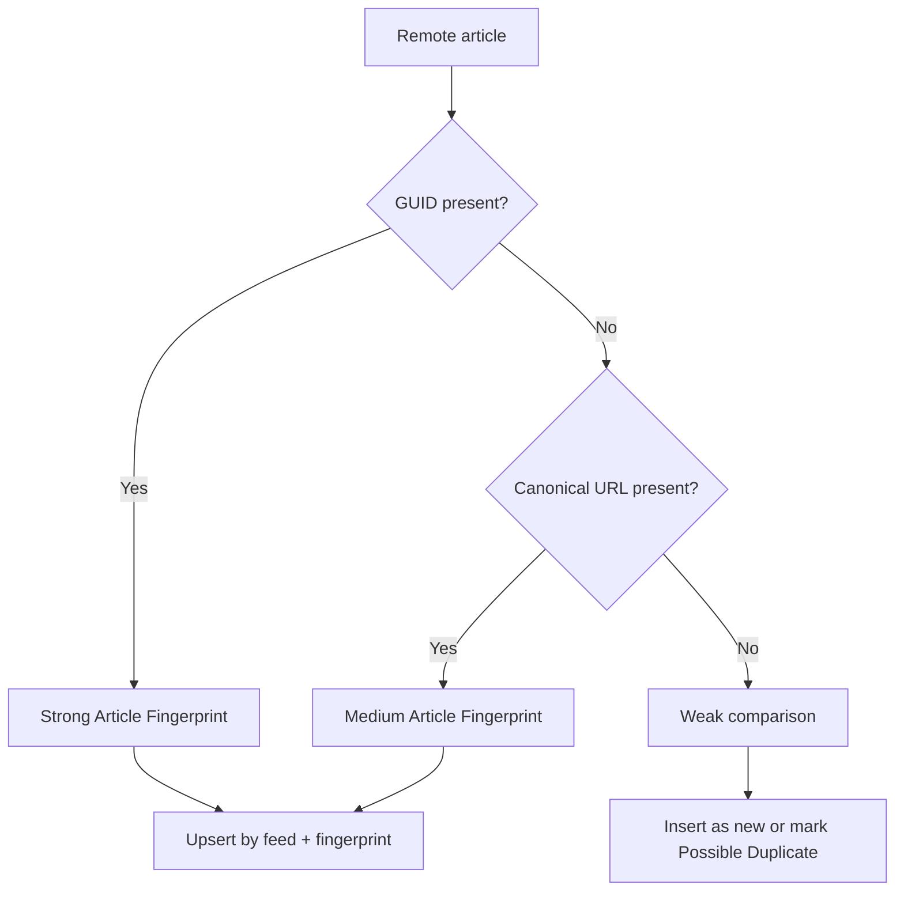
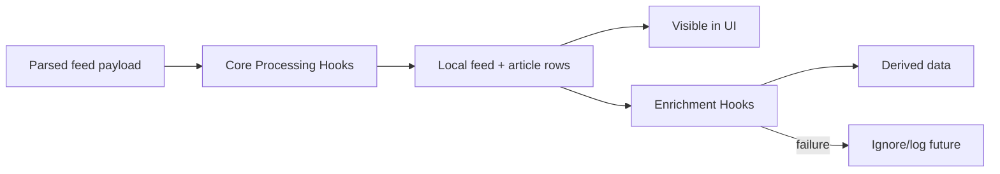

# Feed Import and Sync Processing PRD

## Problem Statement

DevPulse needs a reliable way for users to add web feeds and keep those feeds current without making the UI wait for parsing, storage, or optional enrichment work. Today the feed data layer has parser and repository scaffolding, local Room tables for feeds and content posts, and paginated read paths, but it does not yet define the end-to-end processing model for importing a new feed, syncing an existing feed, reporting processing state, handling incomplete article data, or allowing future enrichment hooks.

Users should be able to submit a feed URL, leave the import flow immediately, and see available feed content appear as soon as the core data is stored. The app must also support later syncs that reconcile new or changed publisher data without destroying user-owned data such as tags, bookmarks, saved state, or future user edits.

## Solution

Feed ingestion will use a queue-first model. A user action creates or reuses a **Feed Processing Job** instead of parsing inline. A processor owned by the feed data implementation will process one feed-level **Core Processing Stage** at a time. The core stage fetches the feed, parses publisher data, runs cheap **Core Processing Hooks**, stores feed metadata and article rows in bounded batches, and marks core processing complete. Optional **Enrichment Hooks** may run afterward at article level without blocking article visibility.

The UI observes durable job state from the database and paginated content flows from the existing local database. Core processing may show an indeterminate loader because total work is unknown until parsing completes and article storage should be fast. Enrichment can expose deterministic progress later because it can process known article sets.

## User Stories

1. As a reader, I want to import a feed by URL, so that I can start reading posts from that publisher.
2. As a reader, I want the import action to return quickly, so that I can keep using the app while processing continues.
3. As a reader, I want imported articles to appear as soon as core data is stored, so that enrichment work does not delay reading.
4. As a reader, I want to see that an import is in progress, so that I understand why content may not have appeared yet.
5. As a reader, I want failed imports to show a useful state, so that I know the feed was not fully processed.
6. As a reader, I want partially stored articles to remain visible after a mid-import failure, so that usable data is not hidden.
7. As a reader, I want a retry-safe import, so that a failed or interrupted job can reconcile already stored articles later.
8. As a reader, I want feed syncs to add new articles, so that existing feeds keep receiving new content.
9. As a reader, I want feed syncs to update publisher-owned article data, so that corrected titles, images, descriptions, comments URLs, media, and categories can improve over time.
10. As a reader, I want feed syncs to preserve user-owned data, so that tags, saved state, bookmarks, and future user edits are not overwritten.
11. As a reader, I want old articles to remain available even if they disappear from the latest feed payload, so that rolling RSS windows do not delete my reading history.
12. As a reader, I want incomplete articles to still appear, so that malformed feeds do not silently lose usable content.
13. As a reader, I want incomplete articles to be marked, so that I can understand when some data is missing.
14. As a reader, I want duplicate-looking articles without confident identity to be handled safely, so that the app does not overwrite the wrong article.
15. As a reader, I want duplicate feed URLs to be coalesced when they are the exact same raw URL, so that repeated imports do not create simultaneous jobs for the same feed.
16. As a reader, I accept that robust feed duplicate detection across different URLs is future scope, so that the first implementation stays focused.
17. As a developer, I want feed imports and syncs represented as durable jobs, so that UI observation and background processing use the same source of truth.
18. As a developer, I want feed-level core processing serialized, so that duplicate import and sync races are avoided.
19. As a developer, I want article-level enrichment to be separate from feed-level processing, so that expensive work can be parallelized later without blocking imports.
20. As a developer, I want core hooks to run before storage, so that cheap deterministic shaping can happen before rows are inserted.
21. As a developer, I want enrichment hooks to run after storage, so that generated tags, summaries, and similar derived data do not delay visibility.
22. As a developer, I want enrichment failures to be ignored or logged without failing the import, so that optional work cannot poison core feed data.
23. As a developer, I want local feed and article IDs generated by the app as UUID7 values, so that identity is stable and not dependent on database auto-generation.
24. As a developer, I want article matching based on an **Article Fingerprint**, so that feed syncs can update existing rows instead of duplicating articles.
25. As a developer, I want GUID-based fingerprints preferred when present, so that publisher-provided identity is used first.
26. As a developer, I want canonical URL matching used when GUID is absent, so that common feeds without GUIDs can still sync correctly.
27. As a developer, I want weak matches treated as possible duplicates, so that uncertain identity does not overwrite existing article data.
28. As a developer, I want the raw **Feed Source URL** stored as entered, so that the first implementation avoids overbuilt URL normalization and identity behavior.
29. As a developer, I want fetch attempts to try a trimmed URL and then the raw stored URL, so that common whitespace mistakes can be tolerated without changing stored identity.
30. As a developer, I want automatic feed sync scheduling deferred, so that the first implementation can establish queue semantics before platform-specific scheduling.
31. As a developer, I want raw feed payload storage out of scope, so that the local database stays focused on queryable feed and article fields.
32. As an AI implementation agent, I want the PRD to clearly distinguish domain decisions from implementation details, so that tasks can be generated without re-litigating decisions.

## Implementation Decisions

### Domain Vocabulary

- **Feed Import** means first-time feed addition from a user-provided URL.
- **Feed Sync** means later reconciliation of an existing feed with latest publisher data.
- **Feed Source URL** means the raw stored URL used as the source for fetch attempts.
- **Feed Processing Job** means queued durable work for one import or sync.
- **Core Processing Stage** means fetch, parse, cheap shaping, and storage.
- **Enrichment Stage** means optional post-storage derived data work.
- **Core Processing Hook** runs before storage and must be cheap, deterministic, local, and based only on already-fetched payload data.
- **Enrichment Hook** runs after storage and may perform slow or complementary work.
- **Article Fingerprint** matches a publisher article across syncs.
- **Local Feed ID** and **Local Article ID** are app-generated UUID7 identifiers.
- **Incomplete Article** remains visible even when important fields are missing.
- **Incomplete Reason** records why an article is incomplete.
- **Possible Duplicate Article** represents weak identity confidence and must not overwrite an existing article.

### Processing Model

- Repository actions enqueue or coalesce jobs; they do not parse feeds inline.
- A feed-level queue processor handles one **Core Processing Stage** at a time.
- Duplicate active jobs for the same exact raw **Feed Source URL** are coalesced.
- The user is not blocked after enqueuing an import or sync.
- Processor startup location is deferred; the processor implementation belongs to the feed data implementation.
- Automatic feed sync scheduling is deferred; the implementation only needs enqueue-capable sync support now.

### Job State

- Job state should use both stage and execution state rather than a large flat status enum.
- Suggested stages: `Queued`, `CoreProcessing`, `CoreComplete`, `EnrichmentProcessing`, `Complete`.
- Suggested execution states: `Waiting`, `Running`, `Succeeded`, `Failed`, `FailedPartial`.
- Core processing progress can be indeterminate.
- Enrichment progress may become deterministic because article counts are known.
- Job rows should contain enough state for UI observation, background processing, retries, and basic error display.

### Feed URL Handling

- Store the raw, untouched **Feed Source URL** in the database.
- Treat exact raw URL match as feed identity for now.
- When fetching, try the trimmed URL first and fall back to the raw stored URL if needed.
- Do not implement robust URL normalization, redirect-based identity, or cross-URL feed duplicate detection in this phase.
- Add future scope for robust duplicate detection across URL variants.

### Feed and Article Identity

- Use UUID7 for **Local Feed ID** and **Local Article ID**.
- Use **Article Fingerprint** separately from local IDs.
- Prefer GUID-based fingerprints when a remote GUID exists.
- Fall back to canonical URL-based fingerprints when GUID is absent.
- Treat weaker title/date/author-style matches as possible duplicates, not overwrite candidates.
- Do not build multi-identity article upgrade architecture now.
- A unique match constraint should prevent duplicate confident article identities within the same feed.

### Storage Behavior

- Fetch and parse should happen outside database transactions.
- Core hooks should run before storage and outside long-lived database transactions.
- Feed metadata and articles should be stored in bounded batches, not one unbounded write.
- A batch size around 100 articles is a reasonable starting point, but implementation may tune it.
- After each successful batch, the job can update stored counts.
- If failure happens after some batches, stored articles remain visible and the job records a partial failure.
- Retry should reconcile by **Article Fingerprint** and upsert safely.

### Article Data Ownership

- **Remote-Owned Article Data** may be updated by **Feed Sync**.
- **User-Owned Article Data** must survive **Feed Sync**.
- Publisher-owned examples include title, images, descriptions, content, comments URL, media fields, categories, author, and publication date.
- User-owned examples include user-created tags, bookmarks, saved state, read state, and future user edits.
- Feed sync never deletes previously stored articles just because they are absent from the latest feed payload.
- Missing articles from a feed response are expected because web feeds are rolling windows.

### Incomplete Articles

- Missing title or GUID should not automatically drop an article.
- Insert an article when it has any user-useful payload, such as link, description, content, image, audio, video, publication date, author, or GUID.
- Store a small machine-readable reason set for incomplete articles.
- Initial reason set: `MissingTitle`, `MissingStableIdentity`, `MissingReadableContent`.
- UI may initially show a generic “Incomplete data” indicator and can expose details later.
- User editing of incomplete article data is future scope.

### Hooks

- **Core Processing Hooks** are allowed to normalize URLs, choose display fields from already parsed payload data, trim or sanitize text, extract media from already parsed fields, compute fingerprints, and validate minimum viability.
- **Core Processing Hooks** must not call the network, call AI services, fetch full HTML, probe images, run expensive duplicate searches, or perform slow enrichment.
- **Enrichment Hooks** are allowed to generate derived data after storage, such as tag suggestions, summaries, image metadata, or other complementary fields.
- **Enrichment Hooks** must not overwrite publisher-owned fields or user-owned fields directly.
- Enrichment failures should be ignored for product state and logged when logging exists.
- Enrichment retry is future scope.

### Modules To Build Or Modify

- `:core:domain:models` should expose domain models and enums for job state, stages, job type, article data quality, incomplete reasons, and feed/article IDs if typed wrappers are introduced.
- `:core:data:db` should own Room entities, DAOs, transactions, indexes, and paging/query support for feeds, articles, job rows, and derived data needed by this phase.
- `:core:data:feed` should own parser integration, repository implementations, queue processor, core hooks, enrichment hooks, mappers, and feed/article matching behavior.
- Domain/use case modules may later expose enqueue and observe operations to presentation layers.
- Feature UI modules should enqueue work and observe state; they should not run queue processing.
- App root can later decide processor lifecycle startup; this is intentionally not part of the first decision set.

### Deep Module Opportunities

- **Feed Queue Processor** should be a deep module: simple public start/process API, internally coordinates job picking, parser, hooks, matching, storage, and status transitions.
- **Article Matcher** should be a deep module: accepts feed context and parsed article identity candidates, returns strong match, medium match, weak possible duplicate, or no match.
- **Core Processing Pipeline** should be a deep module: accepts parsed channel/items, applies core hooks, produces storage-ready feed/article records.
- **Hook Runner** should be a deep module: isolates hook ordering, failure behavior, and future extension without leaking details to repository methods.
- **Job State Store** should be a deep module around DAOs: enqueue/coalesce, claim next job, update stage/state, record counts, mark partial failure.

## Testing Decisions

- Tests should verify observable behavior and state transitions, not private implementation details.
- Parser integration should be tested with representative feed payloads when feasible, but core matching and processing rules should be testable without network calls.
- Feed queue tests should cover enqueue, duplicate coalescing by exact raw **Feed Source URL**, FIFO claiming, one active core job, success, failure, and partial failure.
- Article matching tests should cover GUID match, canonical URL fallback, weak match as possible duplicate, no match, and no overwrite on weak match.
- Feed sync tests should cover remote-owned field updates, user-owned field preservation, and no deletion of unseen local articles.
- Incomplete article tests should cover missing title, missing stable identity, missing readable content, and insertion of partially useful payloads.
- Core hook tests should cover allowed cheap transforms and confirm failures are handled according to pipeline rules.
- Enrichment hook tests should cover derived-data writes and ignored/logged failures without changing core job success.
- Storage tests should cover bounded batch behavior and retry-safe upserts after partial failure.
- Repository/API tests should cover enqueue-first behavior rather than synchronous parser return behavior.
- UI tests are not required for the first processing implementation unless UI work is included; UI can consume Flow-backed state later.
- Existing repo convention favors `commonTest` for shared logic and focused Gradle verification for affected shared modules.

## Out of Scope

- Automatic scheduled background feed sync.
- Platform-specific background worker lifecycle and startup decisions.
- Robust feed duplicate detection across different URLs, redirects, normalized URLs, or publisher self links.
- Raw XML or raw feed payload storage.
- Multi-identity article history or identity-upgrade architecture.
- User editing for incomplete articles.
- Enrichment retry system.
- Remote logging implementation for enrichment errors.
- AI-generated tags, summaries, or other specific enrichment features beyond hook support.
- Full-content web scraping for article bodies.
- Deleting local articles when they disappear from a feed response.
- Large UI redesign for import progress beyond exposing enough job state for future UI.

## Further Notes

- The authoritative architectural decision for queue-first feed processing is recorded in `docs/adr/0001-queue-first-feed-import-and-sync.md`.
- The glossary for accepted domain language is recorded in `CONTEXT.md`.
- The detailed entity relationship model is recorded in `docs/prd/feed-import-sync-erd.md`.
- The local implementation issue backlog is recorded in `docs/issues/feed-import-sync-issues.md`.
- The first implementation should bias toward safe, durable behavior over aggressive deduplication or normalization.
- Article visibility is more important than enrichment completeness.
- The current database has not shipped to users, so changing feed IDs from integer to UUID7 is acceptable now.
- `parseRssFeed(url)` naming should be replaced by enqueue-style commands because parsing is no longer the public behavior.
- Feed-level queue serialization is deliberate; article-level enrichment is where future parallelism belongs.
- For implementation task generation, split work by domain models, DB schema, repository API, queue processor, matching/core pipeline, hook interfaces, and tests.
